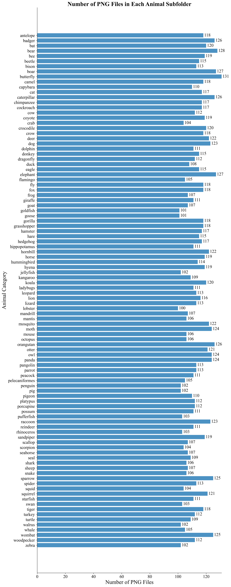
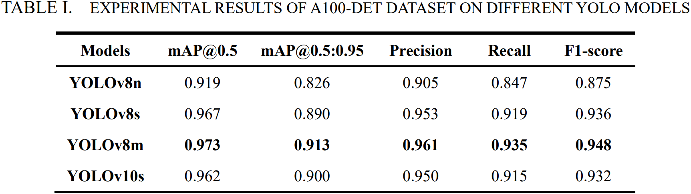
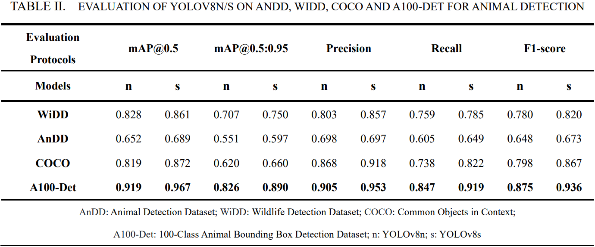
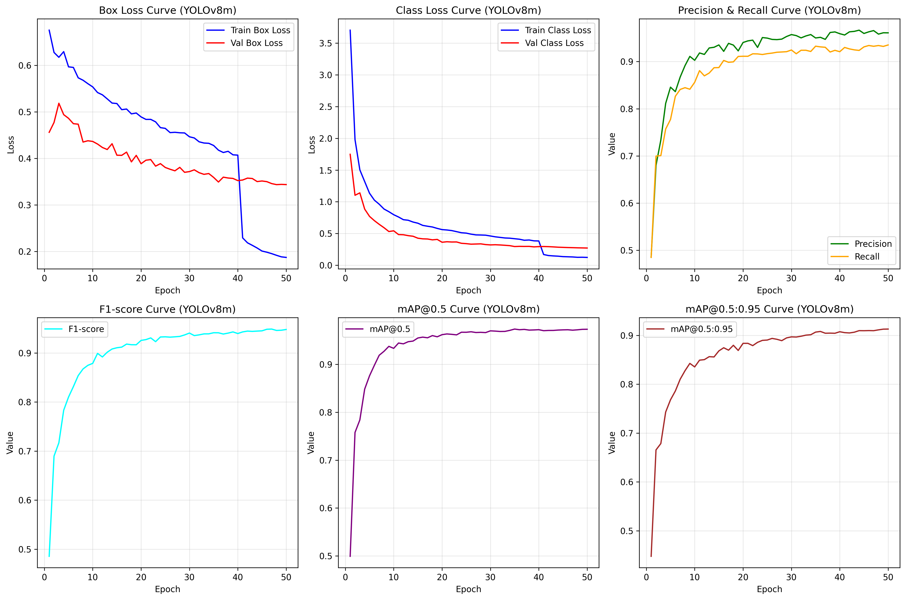
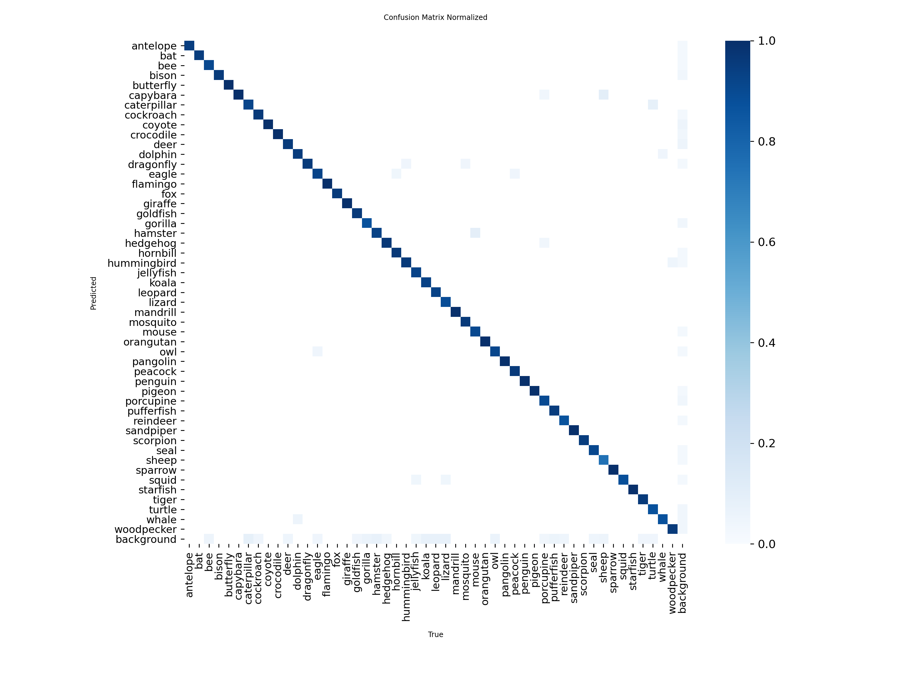
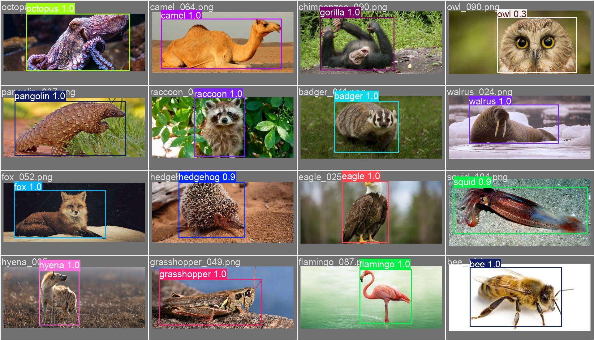

# 100种动物矩形框标注数据集


# 1. 数据集概述

## 1.1 数据集背景与意义

动物目标检测是计算机视觉领域的重要研究方向，广泛应用于野生动物保护、智能监控、农业病虫害防治、生物多样性调查等多个领域。高质量、大规模的标注数据集是提升动物目标检测模型性能的核心基础，然而当前主流权威数据集仍存在一定局限性：

- **COCO数据集**：作为目标检测领域的基准数据集，虽包含部分动物类别，但动物种类覆盖有限（仅数十种），且单类动物样本量不均衡，部分珍稀或小众动物样本缺失，难以满足特定场景下的精细化训练需求。

- **ImageNet数据集**：侧重图像分类任务，虽动物种类丰富，但缺乏针对目标检测的矩形框标注信息，无法直接用于检测模型的训练与验证。

- **PASCAL VOC数据集**：动物类别仅包含猫、狗、鸟等少数常见物种，种类覆盖度极低，且样本量较少，难以支撑复杂场景下的模型训练。

针对上述问题，本数据集构建了包含100种动物的矩形框标注数据集，每种动物样本量控制在100-130张，实现了动物种类的广泛覆盖与单类样本的充足供给。截至目前，尚未有公开数据集能够同时满足“100种以上动物、单类样本量≥100张、高精度矩形框标注”的核心需求，本数据集填补了这一研究空白，可为动物目标检测模型的研发、优化提供高质量的训练与测试数据支撑，尤其能助力小众动物检测、多动物混合场景检测等细分方向的研究推进。


## 1.2 数据集基本信息

- 动物种类：100种（具体种类见class.txt，按首字母顺序排序）

- 样本总量：11354张图片

- 单类样本量：100-130张/种

- 标注类型：矩形框（目标检测）

- 标注格式：X-AnyLabeling 原始 JSON格式、VOC XML格式

- 图片格式：PNG

数据集动物图片数量可见下图：



# 2. 数据获取与标注流程

## 2.1 图片获取

本数据集所有图片均从必应图片搜索（https://cn.bing.com/images）获取，严格遵循版权规范，具体流程如下：

1. 访问必应图片搜索页面，使用筛选器选择“Free to modify, share, and use”（可修改、分享及使用）权限，确保图片使用合规；

2. 以羚羊（antelope）为例，搜索链接为：https://cn.bing.com/images/search?q=antelope&qs=n&form=QBIR&qft=%20filterui%3Alicense-L2_L3_L5_L6，按此方式依次搜索100种动物的图片；

3. 使用Microsoft Edge浏览器扩展插件ImageAssistant，批量提取当前搜索页面的图片并下载；

4. 人工清洗：剔除模糊、遮挡严重、分辨率过低、动物主体不明确或存在版权争议的图片，确保每一张图片的可用性。


## 2.2 标注流程

采用“AI辅助+人工修正”的半自动标注方式，兼顾标注效率与标注精度，具体流程如下：

1. 标注工具：使用开源标注工具X-AnyLabeling（https://github.com/CVHub520/X-AnyLabeling）；

2. AI辅助标注：调用YOLOv8m模型，设置置信度阈值为0.4、交并比（IoU）阈值为0.8，对所有清洗后的图片进行批量预标注；

3. 人工修正：逐一检查AI预标注结果，对标注框位置偏差、漏标、误标的情况进行手动修正；对于AI未检测到的动物目标，进行手动标注，确保每一张图片中的动物主体均被精准标注；

4. 格式导出：标注完成后，保留X-AnyLabeling原始JSON标注文件，并导出为VOC XML格式文件，适配主流目标检测模型（如YOLO系列、Faster R-CNN等）的训练需求。


# 3. 数据集结构

数据集采用清晰的层级文件夹结构，便于用户快速定位和使用数据，整体结构如下：

```makefile
animal/                  # 主文件夹
├─ images/               # 图片文件夹
│  ├─ antelope/          # 动物名称子文件夹（按class.txt顺序排列）
│  │  ├─ antelope_001.png
│  │  ├─ antelope_002.png
│  │  └─ ...（共100-120张）
│  ├─ bear/
│  │  └─ ...
│  └─ ...（共100个动物子文件夹）
├─ annotations/          # 标注文件夹
│  ├─ raw_json/          # X-AnyLabeling原始JSON标注文件
│  │  ├─ antelope/
│  │  │  ├─ antelope_001.json
│  │  │  └─ ...
│  │  └─ ...（共100个动物子文件夹）
│  └─ voc_xml/           # VOC格式XML标注文件
│     ├─ antelope/
│     │  ├─ antelope_001.xml
│     │  └─ ...
│     └─ ...（共100个动物子文件夹）
└─ class.txt             # 动物种类清单（按首字母顺序排列，每行为一种动物）
```

说明：

- class.txt：严格按动物名称首字母顺序排序，是images、annotations文件夹下子文件夹的命名依据，确保数据对应一致；

- 图片命名规则：“动物名称_xxx.png”，其中“xxx”为三位数字（001-130），便于样本的批量读取和管理；

- 标注文件命名：与对应图片名称完全一致，确保图片与标注的一一对应。


# 4. 标注文件示例

## 4.1 X-AnyLabeling 原始 JSON格式（以antelope_001.json为例）

```json
{
  "version": "3.3.9",          // X-AnyLabeling工具版本号
  "flags": {},                 // 自定义标记（本数据集未使用）
  "shapes": [                  // 标注框列表（单张图片仅标注1个动物主体）
    {
      "label": "antelope",     // 标注类别（动物名称）
      "score": 0.899715781211853,  // AI预标注的置信度（AI标注不准确时，人为仅手动修改标注框位置，置信度可忽略）
      "points": [              // 矩形框四个顶点坐标（顺时针顺序：左上、右上、右下、左下）
        [371.7910432815552, 121.02197647094727],
        [947.3024787902832, 121.02197647094727],
        [947.3024787902832, 972.2155342102051],
        [371.7910432815552, 972.2155342102051]
      ],
      "group_id": null,        // 标注组ID（本数据集未使用）
      "description": null,     // 标注描述（本数据集未使用）
      "difficult": false,      // 是否为困难样本（本数据集均为易标注样本）
      "shape_type": "rectangle",  // 标注形状（矩形框）
      "flags": {},             // 标注框自定义标记（本数据集未使用）
      "attributes": {},        // 标注属性（本数据集未使用）
      "kie_linking": []        // KIE关联信息（本数据集未使用）
    }
  ],
  "imagePath": "antelope_001.png",  // 对应图片路径
  "imageData": null,           // 图片Base64编码（本数据集未存储，节省空间）
  "imageHeight": 1025,         // 图片高度（像素）
  "imageWidth": 1640,          // 图片宽度（像素）
  "description": ""            // 图片描述（本数据集未使用）
}
```


## 4.2 VOC XML格式（antelope_001.xml）

```xml
<?xml version="1.0" ?&gt;
&lt;annotation&gt;                 <!-- 标注根节点 -->
  <folder>H:/project/Animal_position/animal/annotations</folder>  <!-- 标注文件所在文件夹路径 -->
  <filename>antelope_001.png&lt;/filename&gt;  <!-- 对应图片文件名 -->
  <size><!-- 图片尺寸信息 -->
    <width>1640&lt;/width&gt;       <!-- 图片宽度（像素） -->
    <height>1025&lt;/height&gt;     <!-- 图片高度（像素） -->
    <depth>3&lt;/depth&gt;          <!-- 图片通道数（RGB为3） -->
  </size&gt;
  &lt;source&gt;                   <!-- 数据来源 -->
    <database>https://github.com/CVHub520/X-AnyLabeling</database&gt;  <!-- 标注工具来源 -->
  </source>
  <object><!-- 目标对象信息 -->
    <name>antelope&lt;/name&gt;     <!-- 目标类别（动物名称） -->
    <pose>Unspecified&lt;/pose&gt;  <!-- 目标姿态（未指定） -->
    <truncated&gt;0&lt;/truncated&gt;  <!-- 是否截断（0=未截断，1=截断） -->
    &lt;occluded&gt;0&lt;/occluded&gt;    <!-- 是否遮挡（0=无遮挡，1=遮挡） -->
    <difficult>0</difficult>  <!-- 是否为困难样本（0=易标注，1=困难） -->
    &lt;bndbox&gt;                 <!-- 矩形框坐标（VOC格式，左上角为(0,0)） -->
      &lt;xmin&gt;371&lt;/xmin&gt;        <!-- 左上角x坐标 -->
      &lt;ymin&gt;121&lt;/ymin&gt;        <!-- 左上角y坐标 -->
      &lt;xmax&gt;947&lt;/xmax&gt;        <!-- 右下角x坐标 -->
      &lt;ymax&gt;972&lt;/ymax&gt;        <!-- 右下角y坐标 -->
    </bndbox>
  </object>
</annotation>
```


# 5. 模型训练效果

本数据集已在YOLO系列模型上进行初步训练，以下为模型性能指标：





此处仅以YOLOv8m为例，展示训练输出部分图像，更多请详见后文 Kaggle 链接：








# 6. 数据集使用说明

- 本数据集可直接用于目标检测模型的训练、验证与测试，支持YOLO系列、Faster R-CNN、SSD等主流模型；

- 使用时需注意：images文件夹与annotations文件夹下的文件一一对应，class.txt为模型训练时的类别配置依据，需确保类别顺序不修改；

- VOC XML格式标注文件可直接用于模型训练，若需转换为其他格式（如COCO JSON），可使用X-AnyLabeling工具或第三方脚本进行转换；

  

Kaggle 训练 log 记录链接：

[A100-Det_YOLOv8n](https://www.kaggle.com/code/rexinshiminxiaozhou/animal-position-box-yolov8n)

[A100-Det_YOLOv8s](https://www.kaggle.com/code/rexinshiminxiaozhou/animal-position-box-yolov8s)

[A100-Det_YOLOv8m](https://www.kaggle.com/code/rexinshiminxiaozhou/animal-position-box-yolov8m)

[A100-Det_YOLOv10s](https://www.kaggle.com/code/rexinshiminxiaozhou/animal-position-box-yolov10s)

[AnDD_YOLOv8n,s](https://www.kaggle.com/code/rexinshiminxiaozhou/add-animal-yolov8n-s)

[WiDD_YOLOv8n,s](https://www.kaggle.com/code/rexinshiminxiaozhou/wdd-animal-yolov8n-s)

[COCO_YOLOv8n,s](https://www.kaggle.com/code/rexinshiminxiaozhou/coco-animal-yolov8n-s)